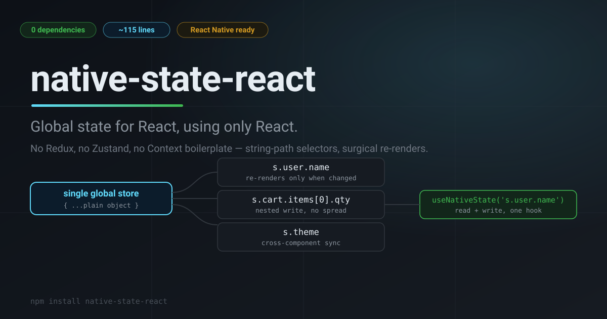
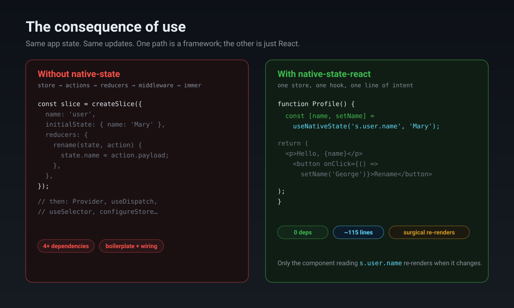

<div align="center">
  
  <p><b>Global state for React, using only React.</b><br/>No Redux, no Zustand, no Context boilerplate — 115 lines of code, string-path selectors, surgical re-renders.</p>
  <p>
    <a href="https://www.npmjs.com/package/native-state-react"></a>
    <a href="https://www.npmjs.com/package/native-state-react"></a>
    <a href="https://github.com/sarath263/native-state"></a>
    <a href="https://bundlephobia.com/package/native-state-react"></a>
  </p>
  <br/>
  <pre>npm install native-state-react</pre>
  <br/>
</div>

> **Note:** the repository is `native-state`; the npm package is **`native-state-react`**. Same library.

## Searchable summary

`native-state-react` is a dependency-free global state library for React. It's a single module (~115 lines) built on React's own `useSyncExternalStore`. It exposes a `<Root>` initializer and two hooks — `useNativeState(path, initial)` to read **and** write a slice, and `useNativeSelector(selector)` to read one — with string-path addressing (`s.user.name`, `s.todos[0].done`) so you update nested state without spreading, without `immer`, and without a reducers/actions/boilerplate layer. Components re-render only when the slice they read (or a sub-slice of it) changes, and the same API works in React Native.

## Why another state library?

React already ships everything you need for global state: `useSyncExternalStore`, `useCallback`, `useMemo`, `useRef`. Most state libraries bolt an entire framework on top of that — a store factory, a subscription system, middleware, devtools, a serialization layer.

`native-state-react` does the opposite: it's the smallest useful thing you can build on those built-ins and still call a state library. **If you know `useState`, you already know the API.** The only new concept is the string path.

## Features

- **Zero dependencies.** Uses only React's built-in hooks. Nothing else to install, ever.
- **~115 lines.** The entire library is one small file. Read all of it in five minutes and know exactly what it does.
- **String-path state.** `useNativeState('s.user.name', 'George')` reads *and* writes a nested slice. No spreads, no reducers, no actions, no immutability helpers.
- **Surgical re-rendering.** A component re-renders only when the slice it reads changes. Backed by React 18's `useSyncExternalStore`, so rendering is tear-free.
- **React Native compatible.** No DOM assumptions — the same API runs on web and native.
- **Two hooks, one concept.** `<Root>`, `useNativeState`, `useNativeSelector`. That's the whole surface.

## Quick start

### 1. Wrap your app in `<Root>`

```jsx
import React from 'react';
import { createRoot } from 'react-dom/client';
import { Root } from 'native-state-react';

createRoot(document.getElementById('root')).render(
  <React.StrictMode>
    <Root initial={{ user: { name: 'Mary' } }}>
      <App />
    </Root>
  </React.StrictMode>
);
```

### 2. Read and write with `useNativeState`

```jsx
import { useNativeState } from 'native-state-react';

function Profile() {
  const [name, setName] = useNativeState('s.user.name', 'Mary');

  return (
    <div>
      <p>Hello, {name}</p>
      <button onClick={() => setName('George')}>Rename</button>
    </div>
  );
}
```

That's it. Any other component that reads `s.user.name` stays in sync automatically.

**See a running demo:** [StackBlitz](https://stackblitz.com/edit/native-state-react?file=src%2FApp.jsx)

## API

### `<Root>`

The root component that initializes the global store. Render it once at the top level, wrapping (or as a sibling of) your app.

- `initial` — *(optional)* Object. The initial state. Defaults to `{}`.
- `children` — *(optional)* React nodes rendered inside `<Root>`.

### `useNativeState(pathString, initialVal?)`

Read **and** write a slice of the global state using string-path notation.

- `pathString` — **String.** The path to select, prefixed with `s.` or `state.`. Examples: `'s.name'`, `'s.school.class'`, `'s.todos[0].title'`, `'state.user.profile.avatar'`.
- `initialVal` — *(optional)* Any. The value to initialize at `pathString` **only if nothing is there yet**. If the path already has a value, it's left untouched (use the setter to change it).

Returns `[value, setValue]`:

- `value` — the current value at `pathString`.
- `setValue` — a function to update that path (accepts a new value or an updater pattern like `useState`).

> [!WARNING]
> For nested reads/writes like `'s.todos[0].title'`, the parent (`s.todos[0]`) must already exist in the store.

### `useNativeSelector(selector)`

Read-only access to a slice of the global state.

- `selector` — **String or Function.** Either a path string (`'s.user.name'`) or a function that returns a slice (`s => s.user.name`).

Returns `value` — the read-only value of the selected slice.

**Which form to use:**

| Selector | Re-render behaviour |
|----------|---------------------|
| `useNativeSelector('s.user.name')` | **Surgical** — subscribes only to that path; unrelated updates never touch it |
| `useNativeSelector(s => s.user.name)` | Runs on every change, but React bails out (via `useSyncExternalStore`) if the returned value is unchanged |

If you only *read* state, prefer `useNativeSelector` with a string path for the most precise subscriptions. Use `useNativeState` when you also need to *write*.

## Comparison

| | **native-state-react** | Context + useState | Redux (Toolkit) | Zustand | Jotai |
|---|---|---|---|---|---|
| Dependencies | **0** | 0 | 4+ | 1 | 1 |
| Core size | **~115 lines** | n/a | ~KBs | ~600 lines | ~1K lines |
| Nested updates | `s.user.name` | manual spread | `createSlice` | `set(s => …)` | separate atoms |
| Re-render scope | **slice** | every consumer | selector | selector | atom |
| Boilerplate | **none** | Provider + context | store/slice/reducers | `create()` | `atom()` |
| React Native | ✅ | ✅ | ✅ | ✅ | ✅ |
| Devtools / middleware | ✗ | ✗ | ✅ | ✅ | ✅ |

## The consequence of use

The whole point of choosing a 115-line, zero-dependency library is what *disappears* when you adopt it — no store factory, no actions/reducers, no `immer`, no wiring. The same state update that takes a slice + reducer + `configureStore` elsewhere is one line here, and only the component that reads the changed slice re-renders.



## How it works

Under the hood it's deliberately boring — that's the point:

1. A single module-level store holds the state (a plain object).
2. `<Root>` seeds that store with your `initial` value once.
3. `useNativeState` and `useNativeSelector` subscribe via `useSyncExternalStore`, keyed by the *path string*.
4. A string path is compiled once and cached, then walked (`s.user.name` → `state.user.name`) to read or write the exact slice.
5. When you write a slice, notifications fan out only to subscribers whose path **is, contains, or is contained by** the updated path — so a change to `s.user.name` never re-renders a component reading `s.cart`.

Because there's no virtual store, no proxy, and no serialization, the runtime cost is the minimum React allows: one store, one subscription, one snapshot comparison.

## Examples

- **[`example/`](example)** — a Create React App demo showing live updates, timestamps, and cross-component syncing (one component writes, another reads the same slice).
- **[`benchmark/`](benchmark)** — a Vite app that compares `native-state-react` against `redux`/`react-redux` and `zustand` side-by-side.

## When to use it — and when not to

**Reach for `native-state-react` when:**

- You're building a small-to-medium app with a single global store.
- You want **zero dependencies** and a core you can actually read in full.
- You like string-path access to nested state instead of spread/`immer` ceremony.

**Reach for Redux or Zustand when:**

- You need devtools, middleware, time-travel debugging, or persistence.
- You need multiple independent stores or lazy/code-split store registration.
- A large team needs enforced, framework-style patterns.

## Honest limitations

No tool is a perfect fit, and this one is intentionally small:

- **One global store.** The store is a single module-level object — no multiple stores or per-feature scoping.
- **No devtools / middleware / persistence.** Bring your own, or use a larger library if you need them.
- **Single initialization.** `<Root>` seeds the store once. Fine for a typical SPA; SSR and multiple React roots need care.
- **No TypeScript declarations yet.** The package ships plain JS. A `index.d.ts` would be a great first PR.

## FAQ

**Is it a drop-in replacement for Redux?**
For the common cases — read a value, update it, subscribe to changes — yes. If you rely on Redux middleware, devtools, or time-travel, those aren't here by design.

**Does it work with React Native?**
Yes. There are no DOM or browser assumptions; the hooks are pure React.

**Which React versions are supported?**
React 18+ (it uses `useSyncExternalStore`), including React 19.

**What's the difference between `s.` and `state.` prefixes?**
They're interchangeable aliases for the root of the store. Pick one and be consistent.

## Why it exists

Most React apps don't need a state framework — they need a shared object and a way to subscribe to changes. React already gives you the subscription primitive; the only missing piece was a small, honest layer that turns a string path into a precise subscription.

That's `native-state-react`: the smallest possible dependency-free answer to "where does my app's state live, and how do components read and change it?" — no ceremony, no magic, and a core you can hold in your head.

## License

Copyright © 2026 Sarath Mohan K. See [LICENSE](LICENSE). This is a **source-available** license (personal and internal business use; redistribution and modification require the author's permission) — not OSI open source. Read it before adopting the library in a product.
